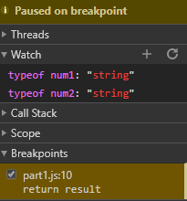
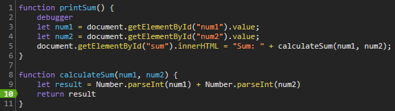

# Debugging

## Breakpoints and watch expressions


## What was the bug
The bug was that ```num1``` and ```num2``` were strings. When these two variables were added in ```calculateSum```, the concatenation operation was called instead of addition resulting in the return value to be ```${num1}${num2}``` instead of ```num1 + num2```.

### How to fix it
I fixed it by using the ```Number.parseInt``` function which takes in a string and outputs a Number object. The fix is implemented as below:



# Network
1. citylots.json
2. part2.js
3. 11.15 MB
4. 1.06 seconds
5. ```Mozilla/5.0 (Windows NT 10.0; Win64; x64) AppleWebKit/537.36 (KHTML, like Gecko) Chrome/80.0.3987.149 Safari/537.36```
6. Apache
7. Tue, 26 Jan 2021 22:14:13 GMT
8. application/json
9. fetchData